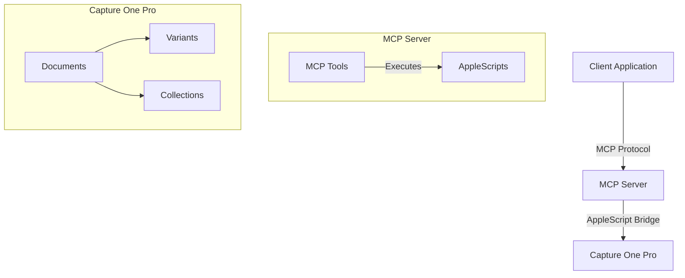
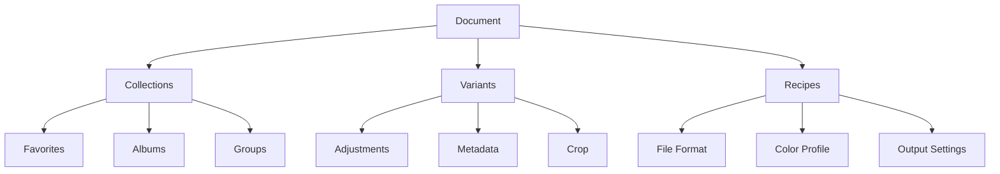

# Capture One MCP Server Documentation

## Introduction
This MCP server exposes Capture One's automation capabilities via AppleScript, providing a bridge between Capture One Pro and your automation workflows. It wraps existing AppleScripts into MCP tools and implements new document/variant management functionality.

## System Architecture


## Implemented MCP Tools

### batch_rename_collection
Provides batch renaming functionality for collections in Capture One.
- **Source:** `src/AppleSripts/Capture One Scripts/batch_rename_collection.applescript`
- **Parameters:**
  - `resetCounter`: Optional parameter to reset the counter during batch rename

**Example Usage:**
```typescript
// Using the MCP tool to batch rename variants in a collection
const result = await mcp.use_tool('batch_rename_collection', {
  resetCounter: true
});
```

### listDocumentsAndVariants
Retrieves information about open documents and their variants.
- **Source:** `src/AppleSripts/Capture One Scripts/get_documents_and_variants.applescript`
- **Returns:** List of open documents and their associated variants

**Example Usage:**
```typescript
// Get all open documents and their variants
const result = await mcp.use_tool('listDocumentsAndVariants');
console.log('Open documents:', result.documents);
```

## Document Model


## Capture One AppleScript Reference

### Key Commands

#### Document Management
Commands for managing Capture One documents and their contents.

```applescript
-- Open a document
tell application "Capture One"
    open "/path/to/document.cos"
end tell

-- Process a variant with specific recipe
tell application "Capture One"
    process variant 1 of document 1 recipe "Web Export"
end tell

-- Export originals
tell application "Capture One"
    tell document 1
        export originals variants {variant 1, variant 2}
    end tell
end tell
```

#### Capture
Commands for tethered capture operations.

```applescript
-- Start live view
tell application "Capture One"
    begin live view
end tell

-- Capture an image
tell application "Capture One"
    capture
end tell
```

#### Selection & Navigation
Commands for managing variant selection and navigation.

```applescript
-- Select specific variants
tell application "Capture One"
    tell document 1
        select variant {variant 1, variant 2}
    end tell
end tell

-- Change selection
tell application "Capture One"
    tell document 1
        change selection to next variant
    end tell
end tell
```

### Important Classes

#### document
Represents a Capture One document (session or catalog).
```applescript
tell application "Capture One"
    set doc to current document
    set docName to name of doc
    set docKind to kind of doc -- session or catalog
    set outPath to output of doc
end tell
```

#### variant
Represents an Image Variant.
```applescript
tell application "Capture One"
    tell current document
        set var to primary variant
        set rating of var to 5
        set color tag of var to 1
    end tell
end tell
```

#### collection
Organizational collection within a document.
```applescript
tell application "Capture One"
    tell current document
        set col to current collection
        set colName to name of col
        set colKind to kind of col
    end tell
end tell
```

#### recipe
Process recipe for output settings.
```applescript
tell application "Capture One"
    tell current document
        set rec to recipe 1
        set name of rec to "Web Export"
        set output format of rec to JPEG
        set JPEG quality of rec to 80
    end tell
end tell
```

### Common Enumerations

#### documentType
Document types in Capture One:
- `session`: Session document
- `catalog`: Catalog document

#### collectionType
Collection types available:
```applescript
-- Collection types
property favorite : "favorite"
property catalog_folder : "catalog folder"
property album : "album"
property group : "group"
property project : "project"
property smart_album : "smart album"
```

#### recipeFileFormat
Available output formats:
```applescript
-- Recipe formats
property JPEG : "JPEG"
property TIFF : "TIFF"
property DNG : "DNG"
property PNG : "PNG"
property PSD : "PSD"
property Original : "Original"
```

#### sort order
Available sorting options:
```applescript
-- Sort orders
property by_name : "by name"
property by_date : "by date"
property by_rating : "by rating"
property by_color_tag : "by color tag"
property by_camera_lens : "by camera lens"
property by_ISO : "by ISO"
-- And more...
